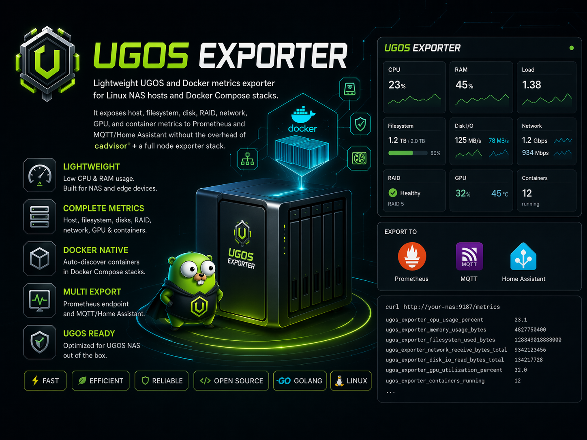

# ugos-exporter

<p align="center" style="text-align: center">
    
</p>

Lightweight UGOS and Docker metrics exporter for Linux NAS hosts and Docker Compose stacks. It exposes host, filesystem, disk, RAID, network, GPU, and container metrics to Prometheus and MQTT/Home Assistant without the overhead of `cadvisor` plus a full node exporter stack.

## Why This Exists

UGOS boxes often end up running both NAS workloads and a pile of Docker Compose services. `ugos-exporter` is meant to cover that combined view in one process:

- Docker container and project metrics
- NAS host health and storage telemetry
- Prometheus scraping
- MQTT + Home Assistant discovery

## Features

- Per-container CPU usage percent
- Per-container memory usage bytes
- Per-project CPU usage percent
- Per-project memory usage bytes
- Total containers per project
- Running containers per project
- Host CPU usage, load, uptime, and per-core usage
- Host CPU frequency and governor data when `cpufreq` is exposed by the kernel
- Host memory and swap usage
- Filesystem usage for mounted NAS paths like `/`, `/volume1`, and `/volume2`
- Physical disk throughput, IOPS, size, and busy percent
- MD RAID / storage pool health and sync progress
- Network throughput, link speed, carrier, errors, and drops
- Bond interface monitoring from `/sys/class/net/*/bonding`, including mode, active slave, slave count, and per-slave link state
- Basic GPU telemetry for `/dev/dri` devices with exposed sysfs counters
- Optional Intel GPU engine/load/power telemetry via `intel_gpu_top`
- Hardware health from `hwmon` and thermal zones, including temperatures and fan RPM where exposed
- Thermal cooling-device state from `/sys/class/thermal/cooling_device*` for systems that expose fan control level instead of RPM
- Disk temperatures are attached to the relevant disk device when sysfs exposes the sensor-to-disk relationship
- Prometheus metrics endpoint
- MQTT JSON state publishing
- Home Assistant MQTT discovery with grouped host, disk, filesystem, network, array, project, and container devices
- Home Assistant binary sensors for container running state, network carrier, and degraded arrays

## Requirements

- Docker Engine API access
- Linux host mounts if you want host / NAS metrics
- Go 1.26+ for local builds
- MQTT broker only if you want MQTT/Home Assistant export

The exporter reads the Docker Engine API directly. By default it uses `unix:///var/run/docker.sock`.
Host metrics are disabled by default and require explicit bind mounts.

## Metrics

Docker metrics:

- `ugos_exporter_container_*`
- `ugos_exporter_project_*`

Host metrics:

- `ugos_exporter_host_cpu_*`
- `ugos_exporter_host_cpu_frequency_mhz`
- `ugos_exporter_host_cpu_governor_info`
- `ugos_exporter_host_memory_bytes`
- `ugos_exporter_host_filesystem_*`
- `ugos_exporter_host_disk_*`
- `ugos_exporter_host_array_*`
- `ugos_exporter_host_network_*`
- `ugos_exporter_host_bond_*`
- `ugos_exporter_host_gpu_*`
- `ugos_exporter_host_gpu_engine_percent`
- `ugos_exporter_host_gpu_stat`
- `ugos_exporter_host_temperature_celsius`
- `ugos_exporter_host_fan_speed_rpm`
- `ugos_exporter_host_cooling_device_*`

Exporter health:

- `ugos_exporter_up`
- `ugos_exporter_last_collection_timestamp_seconds`
- `ugos_exporter_container_stats_errors`

## Build

Local binary:

```bash
go build -o ugos-exporter .
```

Docker image:

```bash
docker build -t ugos-exporter:latest .
```

Published Docker Hub image:

```bash
docker pull rcooler/ugos-exporter:latest
```

Docker Compose example:

```bash
docker compose -f docker-compose.example.yml up -d --build
```

## Run

Local process:

```bash
./ugos-exporter \
  --docker-host unix:///var/run/docker.sock \
  --listen-address :9877
```

Docker container:

```bash
docker run -d \
  --name ugos-exporter \
  -p 9877:9877 \
  -v /var/run/docker.sock:/var/run/docker.sock:ro \
  rcooler/ugos-exporter:latest
```

With NAS host metrics, MQTT, and Home Assistant discovery:

```bash
docker run -d \
  --name ugos-exporter \
  -p 9877:9877 \
  -v /var/run/docker.sock:/var/run/docker.sock:ro \
  -v /proc:/host/proc:ro \
  -v /sys:/host/sys:ro \
  -v /:/rootfs:ro \
  -v /volume1:/volume1:ro \
  -v /volume2:/volume2:ro \
  -v /dev/dri:/dev/dri \
  -e UGOS_EXPORTER_HOST_METRICS_ENABLED=true \
  -e UGOS_EXPORTER_HOST_PROCFS=/host/proc \
  -e UGOS_EXPORTER_HOST_SYSFS=/host/sys \
  -e UGOS_EXPORTER_HOST_NAME=ugreen-nas \
  -e UGOS_EXPORTER_HOST_HOSTNAME_PATH=/rootfs/etc/hostname \
  -e UGOS_EXPORTER_HOST_FILESYSTEMS='/:/rootfs,/volume1:/volume1,/volume2:/volume2' \
  -e UGOS_EXPORTER_HOST_DRI_PATH=/dev/dri \
  -e UGOS_EXPORTER_MQTT_ENABLED=true \
  -e UGOS_EXPORTER_MQTT_BROKER=tcp://host.docker.internal:1883 \
  -e UGOS_EXPORTER_MQTT_USER=ha \
  -e UGOS_EXPORTER_MQTT_PASS=change_me \
  -e UGOS_EXPORTER_MQTT_CLIENT_ID=ugos_exporter \
  -e UGOS_EXPORTER_MQTT_TOPIC_PREFIX=ugos_exporter \
  -e UGOS_EXPORTER_MQTT_DISCOVERY_PREFIX=homeassistant \
  -e UGOS_EXPORTER_MQTT_INTERVAL=60 \
  -e UGOS_EXPORTER_MQTT_RETAIN=true \
  -e UGOS_EXPORTER_MQTT_EXPIRE_AFTER=360 \
  rcooler/ugos-exporter:latest
```

Docker Compose:

```yaml
services:
  ugos-exporter:
    build: .
    restart: unless-stopped
    ports:
      - "9877:9877"
    environment:
      UGOS_EXPORTER_DOCKER_HOST: "unix:///var/run/docker.sock"
      UGOS_EXPORTER_LISTEN_ADDRESS: ":9877"
      UGOS_EXPORTER_SCRAPE_INTERVAL: "15s"
      UGOS_EXPORTER_HOST_METRICS_ENABLED: "true"
      UGOS_EXPORTER_HOST_PROCFS: "/host/proc"
      UGOS_EXPORTER_HOST_SYSFS: "/host/sys"
      UGOS_EXPORTER_HOST_NAME: "ugreen-nas"
      UGOS_EXPORTER_HOST_HOSTNAME_PATH: "/rootfs/etc/hostname"
      UGOS_EXPORTER_HOST_FILESYSTEMS: "/:/rootfs,/volume1:/volume1,/volume2:/volume2"
      UGOS_EXPORTER_HOST_DRI_PATH: "/dev/dri"
      # Optional richer Intel GPU metrics via intel_gpu_top:
      # UGOS_EXPORTER_HOST_INTEL_GPU_TOP_ENABLED: "true"
      # UGOS_EXPORTER_HOST_INTEL_GPU_TOP_DEVICE: "drm:/dev/dri/renderD128"
      # UGOS_EXPORTER_HOST_INTEL_GPU_TOP_PERIOD: "1s"
      UGOS_EXPORTER_MQTT_ENABLED: "true"
      UGOS_EXPORTER_MQTT_BROKER: "tcp://host.docker.internal:1883"
      UGOS_EXPORTER_MQTT_USER: "ha"
      UGOS_EXPORTER_MQTT_PASS: "change_me"
      UGOS_EXPORTER_MQTT_CLIENT_ID: "ugos_exporter"
      UGOS_EXPORTER_MQTT_TOPIC_PREFIX: "ugos_exporter"
      UGOS_EXPORTER_MQTT_DISCOVERY_PREFIX: "homeassistant"
      UGOS_EXPORTER_MQTT_INTERVAL: "60"
      UGOS_EXPORTER_MQTT_RETAIN: "true"
      UGOS_EXPORTER_MQTT_EXPIRE_AFTER: "360"
    volumes:
      - /var/run/docker.sock:/var/run/docker.sock:ro
      - /proc:/host/proc:ro
      - /sys:/host/sys:ro
      - /:/rootfs:ro
      - /volume1:/volume1:ro
      - /volume2:/volume2:ro
      - /dev/dri:/dev/dri
    # Optional for intel_gpu_top on Intel iGPU hosts:
    # privileged: true
    # pid: host
```

Full example file: [docker-compose.example.yml](docker-compose.example.yml)

## Home Assistant Cards

Two Lovelace cards now live under [ha-cards/README.md](ha-cards/README.md):

- `ha-cards/detailed` - full NAS dashboard
- `ha-cards/small` - compact overview card

Both build to minified production bundles under their own `dist/` directories.

## Configuration

Flags and env vars:

- `--listen-address`, `UGOS_EXPORTER_LISTEN_ADDRESS`
- `--metrics-path`, `UGOS_EXPORTER_METRICS_PATH`
- `--scrape-interval`, `UGOS_EXPORTER_SCRAPE_INTERVAL`
- `--docker-host`, `UGOS_EXPORTER_DOCKER_HOST`
- `--docker-timeout`, `UGOS_EXPORTER_DOCKER_TIMEOUT`
- `--project-label`, `UGOS_EXPORTER_PROJECT_LABEL`
- `--standalone-project-name`, `UGOS_EXPORTER_STANDALONE_PROJECT_NAME`
- `--container-concurrency`, `UGOS_EXPORTER_CONTAINER_CONCURRENCY`
- `--mqtt-broker`, `UGOS_EXPORTER_MQTT_BROKER`
- `--mqtt-client-id`, `UGOS_EXPORTER_MQTT_CLIENT_ID`
- `--mqtt-username`, `UGOS_EXPORTER_MQTT_USER`
- `--mqtt-password`, `UGOS_EXPORTER_MQTT_PASS`
- `--mqtt-topic-prefix`, `UGOS_EXPORTER_MQTT_TOPIC_PREFIX`
- `--homeassistant-discovery-prefix`, `UGOS_EXPORTER_MQTT_DISCOVERY_PREFIX`
- `--mqtt-qos`, `UGOS_EXPORTER_MQTT_QOS`
- `--mqtt-retain`, `UGOS_EXPORTER_MQTT_RETAIN`
- `--mqtt-connect-timeout`, `UGOS_EXPORTER_MQTT_CONNECT_TIMEOUT`
- `--homeassistant-expire-after`, `UGOS_EXPORTER_MQTT_EXPIRE_AFTER`
- `--host-metrics-enabled`, `UGOS_EXPORTER_HOST_METRICS_ENABLED`
- `--host-procfs`, `UGOS_EXPORTER_HOST_PROCFS`
- `--host-sysfs`, `UGOS_EXPORTER_HOST_SYSFS`
- `--host-name`, `UGOS_EXPORTER_HOST_NAME`
- `--host-hostname-path`, `UGOS_EXPORTER_HOST_HOSTNAME_PATH`

`UGOS_EXPORTER_HOST_HOSTNAME_PATH` defaults to `/rootfs/etc/hostname`. With the recommended `/:/rootfs:ro` mount, that resolves to the NAS hostname instead of the container hostname.

If UGOS still reports a container-style hostname such as a short hex ID, set `UGOS_EXPORTER_HOST_NAME` explicitly to the NAS name you want in Prometheus and Home Assistant.
- `--host-filesystems`, `UGOS_EXPORTER_HOST_FILESYSTEMS`
- `--host-dri-path`, `UGOS_EXPORTER_HOST_DRI_PATH`
- `--host-intel-gpu-top-enabled`, `UGOS_EXPORTER_HOST_INTEL_GPU_TOP_ENABLED`
- `--host-intel-gpu-top-path`, `UGOS_EXPORTER_HOST_INTEL_GPU_TOP_PATH`
- `--host-intel-gpu-top-device`, `UGOS_EXPORTER_HOST_INTEL_GPU_TOP_DEVICE`
- `--host-intel-gpu-top-period`, `UGOS_EXPORTER_HOST_INTEL_GPU_TOP_PERIOD`

Preferred MQTT env vars:

- `UGOS_EXPORTER_MQTT_ENABLED`
- `UGOS_EXPORTER_MQTT_BROKER`
- `UGOS_EXPORTER_MQTT_USER`
- `UGOS_EXPORTER_MQTT_PASS`
- `UGOS_EXPORTER_MQTT_CLIENT_ID`
- `UGOS_EXPORTER_MQTT_TOPIC_PREFIX`
- `UGOS_EXPORTER_MQTT_DISCOVERY_PREFIX`
- `UGOS_EXPORTER_MQTT_INTERVAL`
- `UGOS_EXPORTER_MQTT_RETAIN`
- `UGOS_EXPORTER_MQTT_QOS`
- `UGOS_EXPORTER_MQTT_CONNECT_TIMEOUT`
- `UGOS_EXPORTER_MQTT_EXPIRE_AFTER`

`UGOS_EXPORTER_MQTT_INTERVAL` and `UGOS_EXPORTER_MQTT_EXPIRE_AFTER` accept either plain seconds like `60` and `360`, or Go duration strings like `60s` and `6m`.

`UGOS_EXPORTER_HOST_FILESYSTEMS` is a comma-separated list of `host_mountpoint:container_path` pairs. For the NAS layout discussed here, use:

```text
/:/rootfs,/volume1:/volume1,/volume2:/volume2
```

## Home Assistant

MQTT discovery creates separate devices for:

- the Linux host
- Docker projects
- Docker containers
- filesystems
- physical disks
- md arrays / storage pools
- network interfaces
- bond interfaces
- GPUs
- hardware health sensors

The Home Assistant entities are split between numeric sensors and binary sensors. Filesystems are attached to their md array device when they are mounted from `/dev/md*`, which makes storage-pool style grouping cleaner in the device view. Bond slaves are attached under the bond device when the interface exposes a master relationship.

## Project Detection

Projects are detected from the label `com.docker.compose.project` by default. Containers without that label are grouped under `standalone`, unless you override it with `--standalone-project-name`.

## Notes

- Supported Docker host schemes: `unix://`, `tcp://`, `http://`, `https://`
- `npipe://` is not implemented in this version
- Docker-only mode only needs the Docker socket mount
- Host metrics mode needs `/proc`, `/sys`, rootfs, target NAS volume mounts, and optionally `/dev/dri`
- GPU busy percent depends on what the host kernel and driver expose in sysfs; frequency metrics are more widely available than true busy counters
- `intel_gpu_top` metrics require the binary in the container image and, on many hosts, `privileged: true`, `pid: host`, plus `/dev/dri`
- Temperature and fan metrics depend on the vendor kernel exposing `hwmon` or `thermal_zone` sensors in `/sys`
- Disk temperature attribution depends on sysfs links under `hwmon`; if UGOS does not expose those links, the sensors stay grouped as generic host health sensors
- CPU frequency and governor metrics depend on `cpufreq` files under `/sys/devices/system/cpu`; some NAS kernels may expose only part of that data

## Release

GoReleaser is configured in `.goreleaser.yml` to publish multi-arch Docker images for `linux/amd64` and `linux/arm64` to Docker Hub as `rcooler/ugos-exporter`.

GitHub Actions release workflow:

- Add repository secrets `DOCKERHUB_USERNAME` and `DOCKERHUB_TOKEN`
- Push a semver tag such as `v1.0.0`
- The workflow publishes Docker tags like `1.0.0`, `latest`, `1.0`, and `1`

Local snapshot test:

```bash
goreleaser release --snapshot --clean
```
