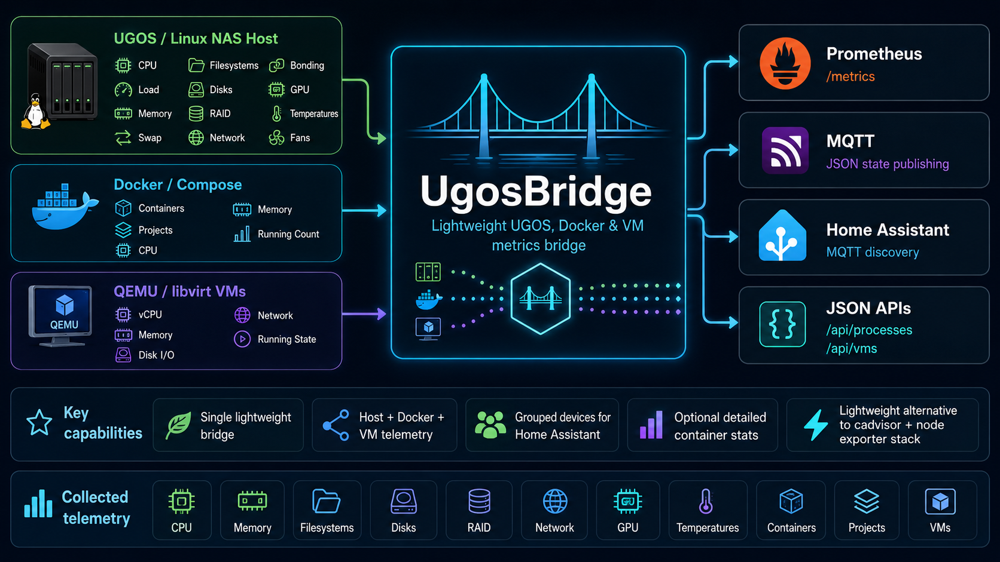

# ugos-bridge

    

Lightweight bridge for UGOS / UGREEN NAS hosts, Docker Compose stacks, and
QEMU/libvirt virtual machines. It collects Docker, VM, host, storage, network,
GPU, and health telemetry and exports it to Prometheus and MQTT/Home Assistant.

## Documentation

- [Data collection](./docs/data-collection.md)
- [Prometheus metrics](./docs/prometheus.md)
- [Home Assistant sensors and devices](./docs/home-assistant.md)
- [Lovelace cards](./ha-cards/README.md)

## Disclaimer

UgosBridge is an unofficial DIY open-source project for compatibility and
integration. It is not affiliated with, endorsed by, or sponsored by UGREEN.
UGREEN, UGOS, and related product names are trademarks or registered trademarks
of their respective owners. They are referenced only to describe compatibility
and integration.

## License

MIT License. See [LICENSE](./LICENSE).

See [NOTICE](./NOTICE) for trademark and affiliation notice.
